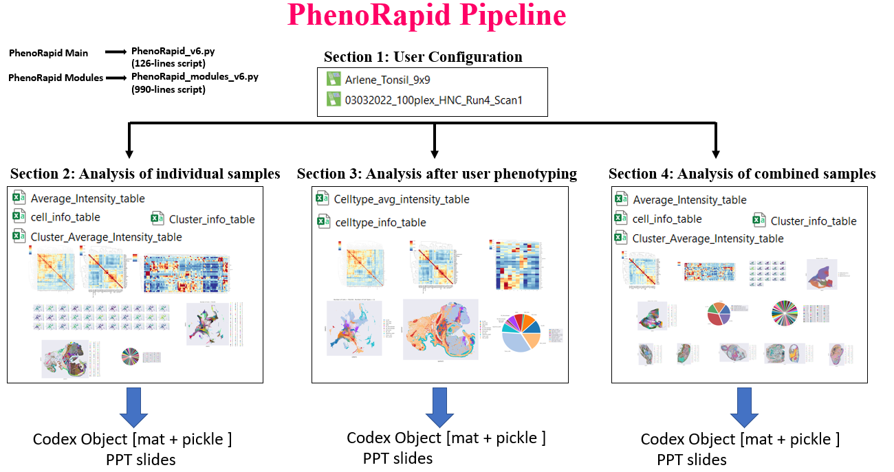
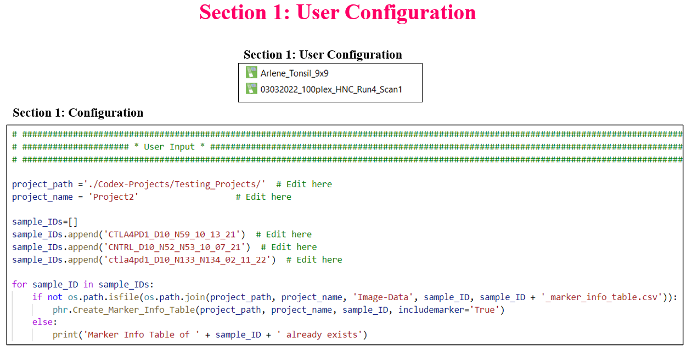
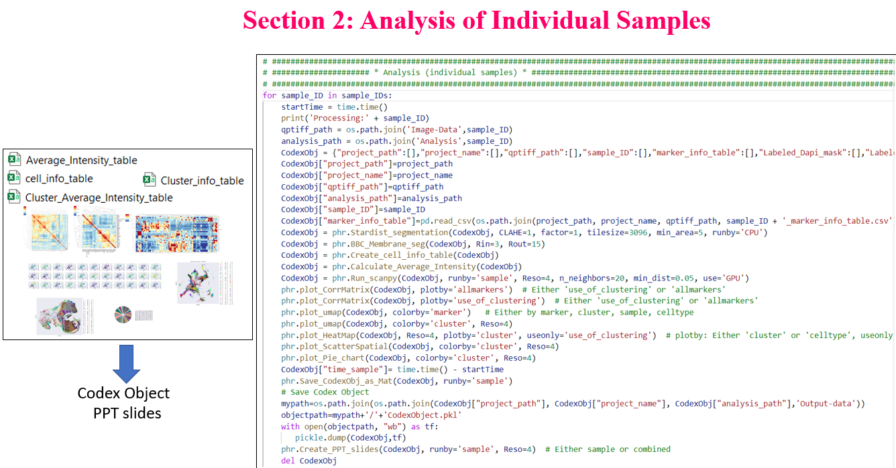
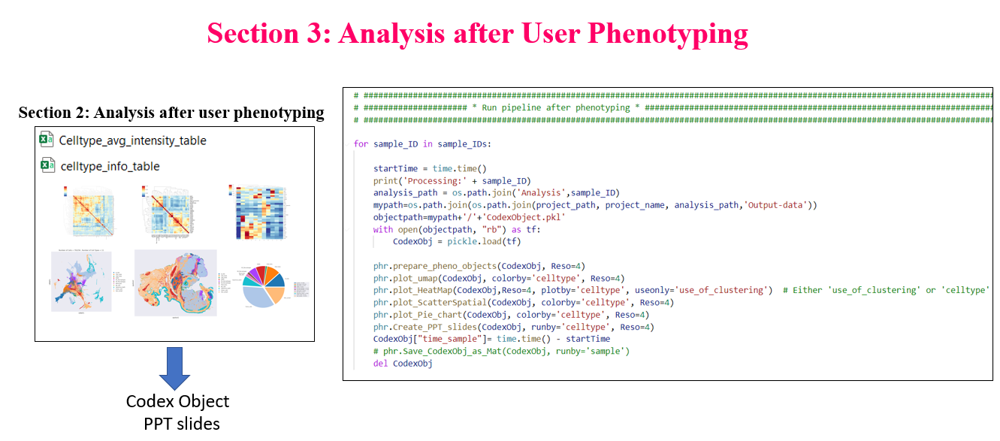
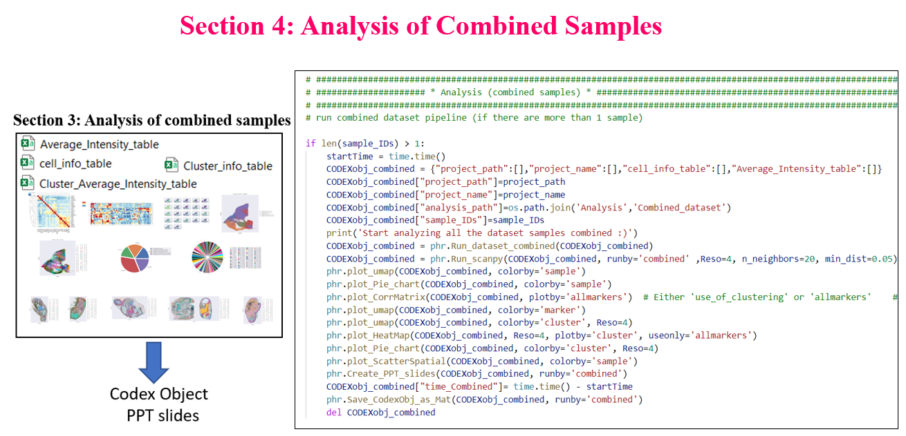

# A rapid High-throughput python-based analysis tool for high-plex images
 Unleash the power of efficiency with just a single click: your high-plex sample undergoes rapid analysis, delivering results in mere minutes. I proudly introduce an innovative pipeline tailored for high-plex image analysis, which embarks on a journey beginning with precise Nuclear and Membrane Segmentation. It progresses through meticulous Computation of Protein Average Intensity, followed by an intricate Protein Cross-Correlation examination. The journey unfolds further into sophisticated Clustering utilizing the cutting-edge RAPIDS library, seamlessly transitioning into Dimension Reduction with PCA for data simplification. The visualization comes to life through TSNE and UMAP, crafting a visual narrative of your data. This analytical odyssey culminates in the production of a diverse array of visual outputs, including but not limited to, informative Pie Charts that encapsulate data elegantly.

The culmination of this robust pipeline is a comprehensive suite of results: 11 detailed figures that capture the essence of your analysis, 6 tables that organize data into digestible formats, and a pair of Segmentation Masks that reveal the intricacies within your samples. This is more than just data processing; it's the art of transforming complex information into actionable insights.

# How to use PhenoRapid

There are four main sections:

**Section 1: User Configuration:** you need to setup the project path in the code, add the samples that you want to analyze and prepare the marker info tables assotiated to them.   

**Section 2: Analysis of Individual Sampels:** The algorithm starts to do the analysis starting by stardist segmentation, membrane segmentation, create cell information tables, calculate average intensities, run clustering, and producing all the tables and plots.

**Section 3: Analysis after User Phenotyping** At this stage the user needs to phenotype and re-run this section to get all the plots and tables after phenotyping.

**Section 4: Analysis of Combined Samples:** Run this section if you want to get the results from multiple samples. 

## How to install :  

Open your linux terminal, install anaconda and copy and paste this command:

conda create -n rapids-22.04 -c rapidsai -c nvidia -c conda-forge \
    rapids=22.04 python=3.8 cudatoolkit=11.5 dask-sql

conda activate rapids-22.04

pip install scanpy

### Project Collaborators and Contact

**Author:** Dr. Yasmin M. Kassim    
**Contact:** ymkgz8@mail.missouri.edu

Contact me if you are intersted about other machine learning and computer vision tasks such as augmentation, dataset annotation, preprocessing, 2D/3D segmentation, 2D/3D object detection, classsification, and denoising.
